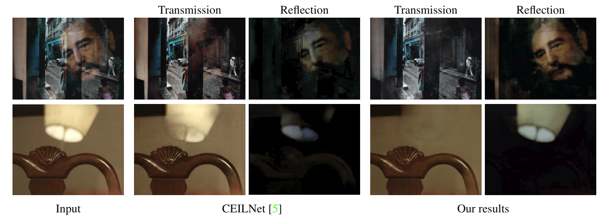

# perceptual-reflection-removal


Code and data for CVPR 2018 paper: Single Image Reflection Removal with Perceptual Losses

[Project Website](https://people.eecs.berkeley.edu/~cecilia77/project-pages/reflection.html) | [Paper](https://arxiv.org/abs/1806.05376)

This code is based on tensorflow. It has been tested on Ubuntu 16.04 LTS.

## 


## Setup
  * Clone/Download this repo
  * `$ cd perceptual-reflection-removal`
  * `$ mkdir VGG_Model`
  * Download [VGG-19](http://www.vlfeat.org/matconvnet/pretrained/#downloading-the-pre-trained-models). Search `imagenet-vgg-verydeep-19` in this page and download `imagenet-vgg-verydeep-19.mat`. We need the pre-trained VGG-19 model for our hypercolumn input and feature loss
  * move the downloaded vgg model to folder `VGG_Model`

### Conda environment

A minimal conda environment to test the pretrained model is provided. (credit to @ironbar)

```
conda env create -f env.yml
```

## Dataset
#### Use our collected synthetic and real data
Both synthetic and real dataset are now available [here](https://drive.google.com/drive/folders/1NYGL3wQ2pRkwfLMcV2zxXDV8JRSoVxwA?usp=sharing).
* synthetically blended data is created on-the-fly so there is only reflection layer and transmission layer folders
* real data has blended images and ground truth transmission layer (*NO ground truth reflection layer*, reason is detailed in the paper)
* real images used for test have indices: [3, 4, 9, 12, 15, 22, 23, 25, 29, 39, 46, 47, 58, 86, 87, 89, 93, 103, 107, 110]
  * special thanks to @Vandermode who helped with sorting out dataset-related problems

#### Try with your own dataset
You can also try with your own dataset. For example, to generate your own synthetic dataset, prepare for two folders of images, one used for transmission layer and the other used for reflection layer. In order to use our data loader, please follow the instructions below to organize your dataset directories. Overall, we name the directory of input image with reflection `blended`, the ground truth transmission layer `transmission_layer` and the ground truth reflection layer `reflection_layer`.

For synthetic data, since we generate images on the fly, there is no need to have the `blended` subdirectory.
>+-- `root_training_synthetic_data`<br>
>>+-- `reflection_layer`<br>
>>+-- `transmission_layer`<br>

For real data, since the ground truth reflection layer is not available, there is no need to have the `reflection_layer` subdirectory.
>+-- `root_training_real_data`<br>
>>+-- `blended`<br>
>>+-- `transmission_layer`<br>

## Training
#### Quick Start
(please have yous real and synthetic data paths set up correctly as described above):

`python3 main.py --data_syn_dir your_syn_data_path --data_real_dir your_real_data_path` for triaining from scratch

`python3 main.py --continue_training --data_syn_dir your_syn_data_path --data_real_dir your_real_data_path --task your_checkpoint_path` for training with existing checkpoint (checkpoint path specified by the `--task` argument)

#### Arguments
`--task`: the checkpoint directory path. For example, for `--task experiment_1`, the checkpoints (e.g. `*.model`) are saved inside `./experiment_1/`

`--data_syn_dir`: root path to the images to generate synthetic data

`--data_real_dir`: root path to the real images

`--save_model_freq`: frequency to save model and the output images

`--is_hyper`: whether to use hypercolumn features as input, all our trained models uses hypercolumn features as input

## Testing

* Download pre-trained model [here](https://drive.google.com/open?id=1I9e2r_e0Ap6ds4MYRwoamUUlz6PzXPPj)
* `$ tar -xvzf pre-trained.tar.gz`
* this should extract the models into a newly created folder called `pre-trained`
* Change `test_path` (line 419) to your test image folder. If you want to test on the provided test images (e.g. in `./test_images/real/`), keep it as it is.
* test results can be found in `./test_results/`

Then, run

`$ python3 main.py --task pre-trained --is_training 0`


## Acknowledgement
Part of the code is based upon [FastImageProcessing](https://github.com/CQFIO/FastImageProcessing)

## Citation
If you find this work useful for your research, please cite:

```
@inproceedings{zhang2018single,
  title = {Single Image Reflection Separation with Perceptual Losses},
  author = {Zhang, Xuaner and Ng, Ren and Chen, Qifeng}
  booktitle = {IEEE Conference on Computer Vision and Pattern Recognition},
  year = {2018}
}
```

## Contact
Please contact me if there is any question (Cecilia Zhang <cecilia77@berkeley.edu>)

